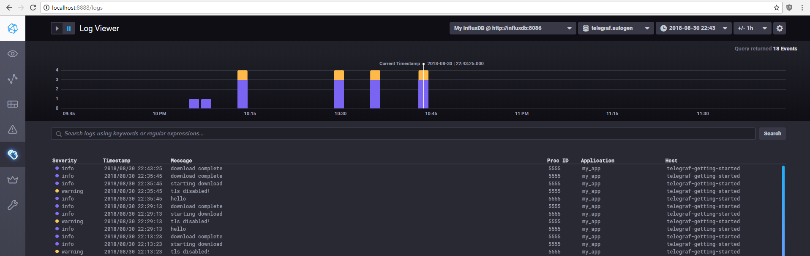

# `slog-syslog5424` - implementation of RFC5424 for `slog`

This crate provides a way for [`slog`](https://github.com/slog-rs/slog) to format its structured messages into the syslog 5424 format which preserves structure.
The output is written to a type provided by the user that implements the `Write` trait.

For the underlying syslog5424 crate, check [here](https://github.com/nocduro/syslog5424).

## Notes
* Should almost always be used with [`slog-async`](https://github.com/slog-rs/async) to avoid slowing down the main thread
* When sending to remote syslog servers (like InfluxDB) the format should be set to RFC5425 to include the length in the message. A TLS writer should ideally also be used.
* When logging directly to a remote syslog server you may find [`slog-retry`](https://github.com/vorner/slog-retry) useful.

## Crate Documentation
Building formatting struct: https://docs.rs/syslog5424

`slog` implementation: https://docs.rs/slog-syslog5424


## Examples

### Basic logging to stderr
```rust
#[macro_use]
extern crate slog;
extern crate slog_syslog5424;

use slog_syslog5424::{Facility, Rfc5424Builder, Rfc5424Writer, WriteFormat};

use slog::Drain;
use std::sync::Mutex;

fn main() {
    let w = std::io::stderr();

    let formatter = Rfc5424Builder::new("enterprise_id", Facility::User)
        .app_name("myapp")
        .expect("invalid app name")
        .hostname("192.0.2.1")
        .expect("invalid hostname")
        .pid("8710")
        .expect("invalid pid")
        .write_format(WriteFormat::RFC5424)
        .build();

    let rfc5424_writer = Rfc5424Writer::new(w, formatter);

    let root = slog::Logger::root(
        Mutex::new(rfc5424_writer).map(slog::Fuse),
        o!("version" => env!("CARGO_PKG_VERSION")),
    );

    info!(root, "service started");
    let sub_log = root.new(o!("address" => "example.com", "port" => "54201"));
    warn!(sub_log, "tls disabled!");
    info!(sub_log, "starting download");
    info!(sub_log, "download complete");
}
```

### Logging to InfluxDB

* Download InfluxDB sandbox: https://github.com/influxdata/sandbox
* configure telegraf to enable syslog input:
  * in `sandbox-master/telegraf/telgraf.conf`: add the following:
  ```yaml
  [[inputs.syslog]]
    server = "tcp://:6514"
  ```
  * in `sandbox-master/docker-compose.yml` modify the ports exposed for the `telegraf` container:
  ```yaml
    telegraf:
      # Full tag list: https://hub.docker.com/r/library/telegraf/tags/
      image: telegraf:latest
      environment:
      HOSTNAME: "telegraf-getting-started"
      # Telegraf requires network access to InfluxDB
      links:
      - influxdb
      volumes:
      # Mount for telegraf configuration
      - ./telegraf/:/etc/telegraf/
      # Mount for Docker API access
      - /var/run/docker.sock:/var/run/docker.sock
      ports:
      - "6514:6514/tcp"
      depends_on:
      - influxdb
  ```
* Start containers: `./sandbox up`
* Modify previous example code to use `TcpStream` AND format in RFC5425:

```rust
#[macro_use]
extern crate slog;
extern crate slog_syslog5424;

use slog_syslog5424::{Facility, Rfc5424Builder, Rfc5424Writer, WriteFormat};

use slog::Drain;
use std::sync::Mutex;
use std::net::TcpStream;

fn main() {
    let w = TcpStream::connect("127.0.0.1:6514").unwrap();

    let formatter = Rfc5424Builder::new("enterprise_id", Facility::User)
        .app_name("myapp")
        .expect("invalid app name")
        .hostname("192.0.2.1")
        .expect("invalid hostname")
        .pid("8710")
        .expect("invalid pid")
        .write_format(WriteFormat::RFC5425) // telegraf only likes 5425
        .build();

    let rfc5424_writer = Rfc5424Writer::new(w, formatter);

    let root = slog::Logger::root(
        Mutex::new(rfc5424_writer).map(slog::Fuse),
        o!("version" => env!("CARGO_PKG_VERSION")),
    );

    info!(root, "service started");
    let sub_log = root.new(o!("address" => "example.com", "port" => "54201"));
    warn!(sub_log, "tls disabled!");
    info!(sub_log, "starting download");
    info!(sub_log, "download complete");
}
```

* view your results in chronograf: http://localhost:8888/logs




## OS support
Doesn't use any specific OS controls, so should work on everything. Just substitute the required writer for your system.

## License
MIT